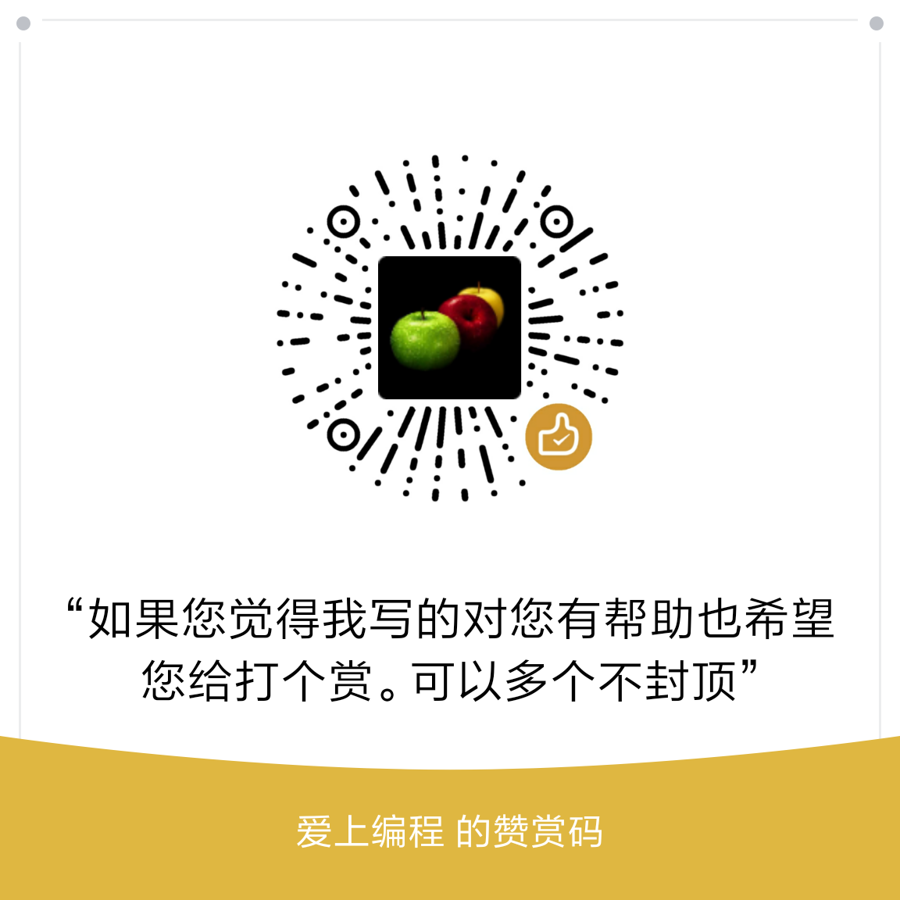

简介
=======

有时想告诉周围的人如何学习和使用php，但却不知道从何说起。有些人说php简单，有些对php不屑一顾，有些则担心效率问题...总之各种诟病。我准备入行学习php时也是各种担心，但是真正用起来以后才发现php真心可爱的。

下面简单介绍一下自己学习php的与感受，希望能帮助想要入门php的朋友尽快入门，能够创造更加丰富多彩的应用。

##  入门简单
php的语法跟C有些相像，几乎所有的php教程里都会这样讲。所以如果你有编程基础，php会很容易。当然这不是阻挡没有编程基础的朋友前来学习。php足够简单，只要想学习，都能学会哦。
##  文档丰富
php的开发文档( http://php.net/manual/zh/ )内容很丰富，有语言参考和函数参考等，涵盖了php的各个方面。在我看来好好阅读官方文档，胜过阅读其他任何教程。而且能够让你摆脱对搜索引擎的依赖。我接触的一些朋友，入门php时，总有些奇怪的动作，就是关于php的知识总是依靠搜索引擎。当然这是基础不扎实。而且当我要求他们看文档的时候，总觉得不可靠。事实是，他们坚持把语言参考阅读几遍以后，编码的效率确实提升很多。
##  丰富的框架
php有很多框架，用来简化web应用的开发。使用框架可以让你将自己思维完全放在业务实现上，不必过于关心诸如连接数据库的操作或者使用缓存的操作。现在流行的ThinkPHP( http://www.thinkphp.cn/ )，CI(http://codeigniter.org.cn/ )，Yii( http://www.yiiframework.com/ ),laravel( http://laravel.com/),phalcon (https://phalconphp.com/zh/ )等等，各有各的特点。读者可以都尝试一下。

## 联系我
有想进一步学习的朋友也可以加我微信：

喜欢的朋友，码字不易，请您打个赏：
